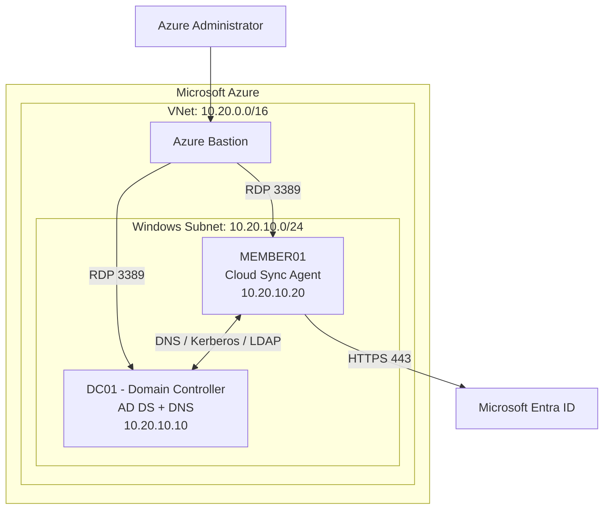

# Secure Hybrid Enterprise Infrastructure & Identity Management Lab

## Project Overview

Designed and deployed a Windows Server enterprise environment in Microsoft Azure using Terraform, PowerShell, Active Directory Domain Services (AD DS), and Microsoft Entra ID.

The project simulates an organization's infrastructure and identity-management operations, including employee provisioning, domain administration, Group Policy enforcement, network segmentation, and hybrid identity synchronization.

**Technologies:** Microsoft Azure, Terraform, Windows Server 2022, Active Directory, DNS, PowerShell, Group Policy, Azure Bastion, Microsoft Entra Cloud Sync, Git.

## Infrastructure Architecture


The hybrid lab extends an existing Terraform-managed Azure virtual network and uses Azure Bastion for private administrative access.

| Component | Configuration |
|---|---|
| Virtual network | `vnet-secure-infra` — `10.20.0.0/16` |
| Windows subnet | `snet-windows` — `10.20.10.0/24` |
| Domain controller | `dc01` — `10.20.10.10` |
| Member server | `member01` — `10.20.10.20` |
| Active Directory domain | `corp.nigellab.test` |
| Administrative access | Azure Bastion |
| Hybrid identity platform | Microsoft Entra ID |
| Provisioning agent | MEMBER01 |

The domain controller provides Active Directory and DNS services. MEMBER01 is domain-joined and hosts the Microsoft Entra provisioning agent.

## Active Directory and Identity Management

Configured a Windows Server Active Directory environment with:

- A new Active Directory forest and integrated DNS services.
- Organizational units for IT, Human Resources, Finance, Operations, member servers, and workstations.
- Department-specific security groups.
- Ten fictional employee accounts organized into departmental OUs.
- Group assignments to support role-based administration.
- A domain-joined member server with a verified secure channel.

## PowerShell Automation

Developed PowerShell scripts to automate routine administrative tasks, including:

- Creating organizational units and security groups.
- Provisioning fictional employee accounts.
- Importing new hires from a CSV file.
- Assigning employees to their department's security group.
- Configuring and verifying Group Policy.
- Creating a group Managed Service Account (gMSA).
- Preparing pilot identities for cloud synchronization.

The CSV onboarding workflow validates department selections and checks for existing accounts before creating users.

## Hybrid Identity — Microsoft Entra Cloud Sync

Implemented hybrid identity provisioning between on-premises-style Active Directory hosted in Azure and Microsoft Entra ID.

Key implementation details:

- Installed and registered the Microsoft Entra provisioning agent on MEMBER01.
- Configured a custom group Managed Service Account for provisioning.
- Authorized MEMBER01 to retrieve and use the gMSA credentials.
- Scoped synchronization to a dedicated pilot security group.
- Configured two fictional employee accounts with cloud-compatible user principal names.
- Successfully provisioned both accounts into Microsoft Entra ID.
- Verified a completed automatic Cloud Sync provisioning cycle.

**Pilot identities:** Nadia Ortiz (Finance) and Leo Bennett (IT).

Both accounts remained disabled for sign-in during provisioning, preserving their Active Directory account status.

Password hash synchronization was intentionally disabled in this pilot configuration.

## Infrastructure Security

### Network Security

Configured a subnet-associated Network Security Group (NSG) to restrict administrative RDP access:

| Priority | Rule | Action |
|---|---|---|
| 100 | Allow TCP 3389 from Azure Bastion subnet | Allow |
| 200 | Deny TCP 3389 from other matching VirtualNetwork sources | Deny |
| 65000 | Default virtual-network inbound rule | Allow |
| 65500 | Default unmatched inbound rule | Deny |

This approach restricts RDP access without introducing a broad deny rule that would block required Active Directory communications.

### Group Policy

Created and linked a Group Policy Object named `LAB - Enforce Domain Firewall` to the Member Servers OU.

Verified that MEMBER01 received the policy and that its Windows Defender Firewall Domain profile was enabled.

### Infrastructure as Code

Managed Windows infrastructure, network interfaces, subnet configuration, and security controls through Terraform.

After implementing an Azure NSG change, updated Terraform to match the deployed configuration and verified the result with:

`terraform plan`

**Result:** No changes; infrastructure matches the configuration.

## Validation Results

| Test | Result |
|---|---|
| Active Directory and DNS services | Passed |
| DNS service-record resolution | Passed |
| MEMBER01 domain join | Passed |
| Domain secure channel | Passed |
| PowerShell employee provisioning | Passed |
| Departmental security-group membership | Passed |
| Domain Firewall GPO application | Passed |
| gMSA installation and validation | Passed |
| Two-user Entra provisioning | Passed |
| Automatic Cloud Sync cycle | Completed |
| Terraform drift check | No changes |

## Prerequisites and Deployment

This is a **dependent lab**, not a standalone deployment. First deploy the [Secure Three-Tier Azure Infrastructure](https://github.com/NigelG100/azure-secure-infrastructure) project, which owns the existing `vnet-secure-infra` network (`10.20.0.0/16`) and Azure Bastion resources. This project creates a separate hybrid-lab resource group, adds the Windows subnet (`10.20.10.0/24`) to that existing VNet, and provisions DC01 and MEMBER01.

Prerequisites:

- An Azure subscription with sufficient resource permissions, and permission to use the existing VNet and Bastion resources. Running Windows VMs and Bastion may incur charges.
- [Terraform](https://developer.hashicorp.com/terraform/install), the [Azure CLI](https://learn.microsoft.com/en-us/cli/azure/install-azure-cli), and PowerShell for the administrative tasks.
- Secure values for both required, sensitive Terraform inputs: `admin_password` (DC01) and `member_admin_password` (MEMBER01). Provide these interactively or using a local ignored variable file; never publish real passwords or state files.
- Appropriate permissions in the Microsoft Entra tenant and Windows domain to install and configure the Cloud Sync provisioning agent and perform the documented identity administration tasks.

From this repository directory, select the Azure subscription hosting Project 1 and review the Terraform plan before applying:

```powershell
az login
az account set --subscription "<subscription-id>"
terraform init
terraform validate
terraform plan
terraform apply
```

**Important:** Terraform provisions the Azure VM and networking resources; the complete identity environment also requires Windows Server administration. Configure AD DS/DNS on DC01, domain-join MEMBER01, and use the documented `scripts/` workflows to create the lab OUs, groups, fictional users, Group Policy, and pilot identity configuration. Install/configure the Entra Cloud Sync agent and verify synchronization separately. Running Terraform alone does not automatically complete those steps.

**Shared-infrastructure safeguard:** Project 1 and this project use different Terraform states but share the VNet. Review `terraform plan` in **both** project directories before approving infrastructure changes, and avoid unexpected deletion or modification of the shared subnet or Bastion dependencies.

## Repository Structure

- `main.tf` — Core Azure infrastructure and security resources
- `member.tf` — Member-server infrastructure
- `scripts/` — Active Directory, identity, and security automation
- `data/` — Fictional employee onboarding data
- `.gitignore` — Excludes Terraform state, local diagnostic scripts, and credential-related files
- `.terraform.lock.hcl` — Terraform provider dependency lock file

The shared virtual network and Azure Bastion deployment belong to a separate infrastructure project and are referenced or reused by this lab.

## Skills Demonstrated

**Cloud administration:** Infrastructure deployment, VM networking, private administrative access, and Azure resource management.

**Systems administration:** Windows Server, DNS, Active Directory, organizational units, Group Policy, and domain troubleshooting.

**Identity and access management:** Employee lifecycle automation, security groups, managed service accounts, and Microsoft Entra provisioning.

**Infrastructure security:** Network access restrictions, Windows Firewall enforcement, controlled provisioning scope, and Terraform configuration validation.

**Troubleshooting:** Investigated authentication failures, reviewed Windows and provisioning-agent logs, deployed a custom gMSA, and verified successful end-to-end identity provisioning.

## Security and Lab Notes

This project uses an isolated learning environment with fictional employee identities. Its single-domain-controller KDS initialization is lab-specific and is not a production deployment procedure.

Administrator passwords, Terraform state, deployment secrets, and recovery scripts are not intended for publication.

The project demonstrates infrastructure administration and hybrid identity provisioning; it has not been presented as a production-hardened deployment or completed vulnerability assessment.